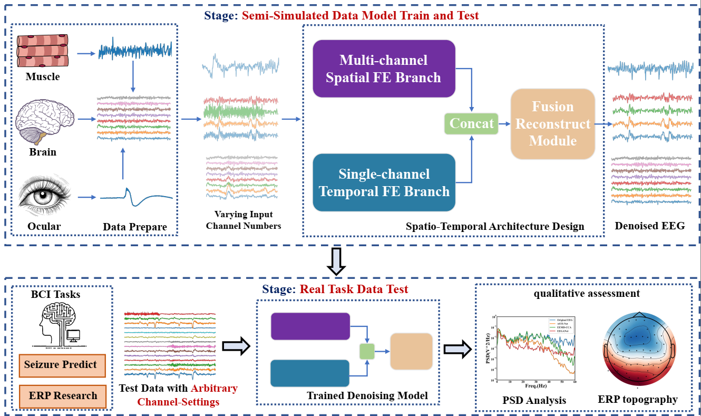
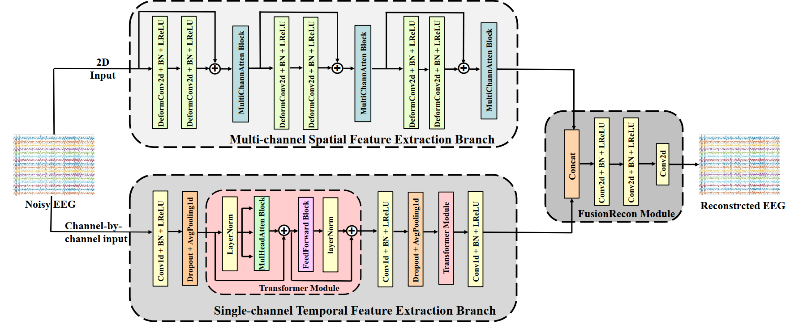
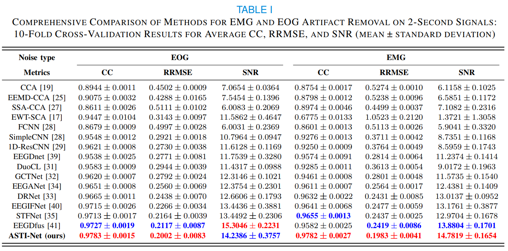

# ASTI-Net
## Overview
This repository contains the implementation of ASTI-Net, a novel deep learning-based architecture designed for artifact removal in EEG signals with arbitrary channel settings. ASTI-Net leverages a dual-branch network to capture both spatial and temporal features of EEG signals, enabling effective denoising across varying numbers of EEG channels. The model is particularly useful for applications in neuroscience, brain-computer interfaces, and clinical studies where EEG signals are often contaminated by artifacts such as EOG (electrooculography) and EMG (electromyography).

## Network Structure

## Results

## Environment Requirements

### Python Version
- Python >= 3.8

### Dependencies

We recommend using `pip` or `conda` to install the required dependencies. Below is the list of key packages and their versions:

#### Main Packages

- PyTorch >= 2.3.0
- torchmetrics >= 1.5.1
- torchaudio >= 2.3.0
- torchvision >= 0.18.0
- numpy >= 1.24.3
- pandas >= 2.0.3
- scikit-learn >= 1.3.0
- scipy >= 1.10.1
- matplotlib >= 3.7.2
- seaborn >= 0.13.2
- tqdm >= 4.66.4
- requests >= 2.31.0
